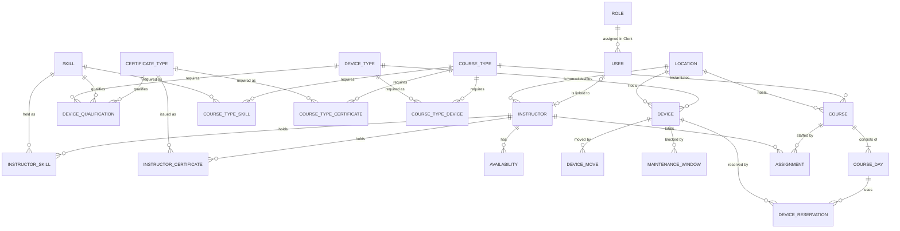
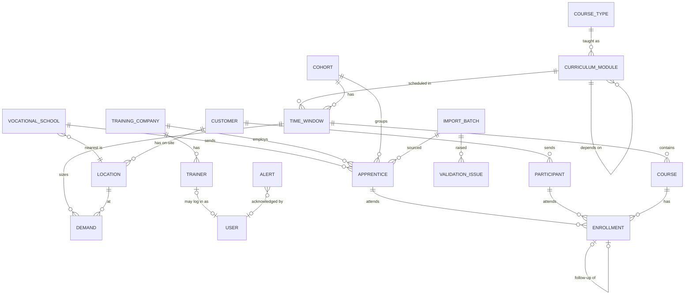

# Entities

The domain model of the SVBL planning tool: which things exist, what they know, and how they relate. Derived from the data-model list in the [[30 Projects/SVBL/Notes/Roadmap|Roadmap]] (phase 2) and from the [[30 Projects/SVBL/Notes/Interview Protocol|Interview Protocol]]. It is the basis for the phase 2 data model, the import pipeline, and the matching rules. The requirements that use these entities are in [[30 Projects/SVBL/Notes/Requirements|Requirements]].

Conventions: entity names in English, German term in parentheses on first use and in the glossary. Attributes are indicative, not a schema. Cardinalities read left to right.

## Glossary

| German | English used here | Note |
|---|---|---|
| Ausbilder, Ausbildner, Instruktor | Instructor | employee or freelancer who teaches |
| Lernende, Lernender | Apprentice | in EFZ or EBA training, attends ÜK |
| Überbetrieblicher Kurs (ÜK) | Inter-company course (ÜK) | mandatory course days for apprentices, about 25 over 3 years |
| EFZ, EBA | EFZ track, EBA track | 3-year federal certificate vs. 2-year federal attestation; about 80 % vs. 20 % of apprentices |
| Berufsschule | Vocational school | delivers the apprentice CSV; about 20 schools |
| Lehrbetrieb | Training company | employs the apprentice |
| Lehrmeister, Berufsbildner | Trainer | person at the training company, can enroll apprentices |
| Kunde | Customer | company booking adult or on-site courses |
| Teilnehmer | Participant | adult course participant |
| Kurstyp | Course type | template: what a course is |
| Kurs, Durchführung | Course | a scheduled instance of a course type |
| Kurstag | Course day | one day of a course |
| Zeitfenster | Time window | period in which an ÜK module has to run |
| Bildungsplan, ÜK-Modul | Curriculum, curriculum module | ordered ÜK modules per track |
| Jahrgang | Cohort | apprentices of one track starting in the same year |
| Bedarf | Demand | how many courses are needed where and when |
| Standort | Location | one of 11 training centres or an external site |
| Gerät, Maschine | Device | forklift, aerial platform, crane |
| Zertifikat | Certificate | time-limited qualification, 1 to 5 years |
| Skill, Qualifikation, Profession | Skill | ability or profession an instructor holds |
| Verfügbarkeit | Availability | free, absent, vacation, blocked |
| Einsatz, Zuweisung | Assignment | instructor on a course |
| Disposition | Resource planning | the planners' job |

## Entity relationship overview

Two diagrams for readability. `USER`, `LOCATION`, and `COURSE` appear in both.

### Resources and courses

### Participants, curriculum, and demand

## Entities

### People and access

#### User
An account that can log in.
- Attributes: id, Clerk user id, email, display name, role (mirrored from Clerk), locale (de, fr, it), status (active, disabled), last login
- Relations: exactly one Role; optionally linked to exactly one Instructor or one Trainer
- Rules: authentication and role assignment happen in Clerk ([[ADR-0003 Start with Clerk for Authentication|ADR-0003]]); this row mirrors the Clerk user id and role and is created by webhook or on first login. It carries the links to Instructor or Trainer and is referenced by audit entries and approvals. Deactivating keeps history

#### Role
What a user may see and change. Fixed set for the PoC. Roles are defined and assigned in Clerk under these names; the backend maps each role to the permissions below and enforces them.

| Role | Sees | Changes |
|---|---|---|
| Planner (Planung) | everything | courses, assignments, devices, availability approvals, imports |
| Sales | courses, capacity, customers, participants | adult-course demand, customer bookings |
| Management (Geschäftsleitung) | dashboards, utilization, reports | nothing |
| Instructor (Ausbilder) | own assignments, own certificates, own availability, course basics | own vacation requests |
| Trainer (Lehrmeister), external | own apprentices and their courses | enroll own apprentices |
| Admin | everything | users, roles, master data, rule configuration |

#### Instructor (Ausbilder)
A person who teaches courses. Employee or freelancer.
- Attributes: person data, contact, employment type (employee, freelancer), home Location, languages (D, F, I), work-time model, overtime cap, cost rate, preferences and notes (implicit knowledge), status
- Relations: many Skills, many Certificates, many Availabilities, many Assignments; optional User
- Rules: about 70 employees and 140 freelancers with different availability and cost rules. Only feasible instructors can be assigned, see the constraint table. Instructors see only their own data

#### Skill
An ability or profession an instructor holds and a course type can require.
- Attributes: name, category, description
- Relations: Instructor via InstructorSkill (level, since); Course type via CourseTypeSkill; Device type via DeviceQualification
- Rules: hard requirement; the instructor needs every skill the course type lists

#### Certificate type and Instructor certificate (Zertifikat)
A time-limited, formal qualification.
- Certificate type attributes: name, issuer (SUVA, IPAF, internal), validity in years (1 to 5, or none), warning lead time in days, maintenance rule (for example minimum courses taught per year)
- Instructor certificate attributes: instructor, certificate type, issued on, valid until, document, derived status (valid, expiring, expired)
- Relations: Course type via CourseTypeCertificate; Device type via DeviceQualification
- Rules: validity is checked on every course day of an assignment. Traffic light on the dashboard. IPAF instructors have to teach the aerial-platform course at least 5 times a year; exact rule open

#### Device qualification
Which certificate type or skill lets an instructor teach on a device type.
- Attributes: device type, certificate type or skill
- Rules: an instructor is qualified for a device type when holding at least one qualifying skill or valid certificate

#### Availability (Verfügbarkeit)
A period in an instructor's calendar.
- Attributes: instructor, from, to, kind (available, absent, vacation requested, vacation approved, blocked, assigned), source (manual, request, import), approved by, approved at
- Rules: vacation requests need planner approval. Assigned periods are derived from Assignments. Freelancer availability model is open

### Places and equipment

#### Location (Standort)
A place where courses happen.
- Attributes: name, kind (training centre, external customer site), address, canton, language region, rooms or parallel-course capacity, contact, active
- Relations: hosts Courses and Devices; home of Instructors; nearest to Vocational schools; on-site location of a Customer
- Rules: 11 training centres, 5 of which host ÜK. Location is a soft constraint for instructors, a hard one for devices

#### Vocational school (Berufsschule)
The school an apprentice attends; source of the apprentice list.
- Attributes: name, address, canton, nearest Location, contact, CSV column mapping, school holidays
- Relations: sends Apprentices; maps to one Location
- Rules: about 20 schools map onto 5 ÜK locations. The default location of an apprentice's ÜK is the location nearest their school

#### Device type and Device (Gerät)
Equipment a course needs.
- Device type attributes: name, category (forklift S, BM, R1 to R4; aerial platform; crane; other), required qualifications
- Device attributes: device type, inventory number, current Location, movable, status (available, in maintenance, retired)
- Related records: Device move (device, from location, to location, date); Maintenance window (device, from, to, note); Device reservation (device, course day)
- Rules: one reservation per device per course day. Moves and maintenance windows change availability by date; whether devices move at all is open

### Courses and curriculum

#### Course type (Kurstyp)
The template that says what a course is.
- Attributes: code, name, kind (ÜK, adult, exam or re-examination), track (EFZ, EBA, both, none), duration in days (1, 2, 4), may span weeks, weekday rule (weekdays, Saturday), offered languages, min and max participants, description, published to website
- Relations: required Skills, required Certificate types, required Device types with quantity; instantiated by Courses; taught as Curriculum modules
- Rules: an ÜK course type is exactly one curriculum module per track

#### Curriculum module (ÜK-Modul)
One ÜK in the training plan of a track.
- Attributes: track, course type, semester (1 to 6), sequence, days, prerequisite modules
- Relations: depends on other modules; scheduled in Time windows
- Rules: the semester is fixed (hard), the timing inside the semester is flexible. EFZ has about 25 ÜK days over 3 years; EBA has its own, shorter plan

#### Cohort (Jahrgang)
Apprentices of one track who started in the same year.
- Attributes: track, start year, expected end year, size
- Relations: groups Apprentices; has Time windows
- Rules: gives every apprentice a curriculum timeline. Whether cohorts are further split by school or region is open

#### Time window (Zeitfenster)
The period in which one curriculum module has to run for one cohort.
- Attributes: curriculum module, cohort, from, to, region or Location (optional), courses needed (derived from Demand)
- Relations: contains Courses; sized by Demand
- Rules: every ÜK course lies inside a time window. Windows are derived from the semester rule and school days

#### Demand (Bedarf)
How many courses are needed where and when.
- Attributes: time window, Location, apprentice count, courses needed (apprentices divided by max participants, rounded up), source (school import, sales forecast, manual), status
- Rules: first step of planning. Demand → courses → time windows → availability. Adult demand comes from Sales

#### Course (Kursdurchführung)
A scheduled instance of a course type.
- Attributes: course type, Location, language, time window (ÜK only), start, end, capacity, status (demand, planned, open, confirmed, running, done, cancelled), published, created by, notes
- Relations: one or more Course days; Assignments; Enrollments; Device reservations through course days
- Rules: status flow below. Cancelling creates follow-up enrollments and releases instructors and devices

#### Course day (Kurstag)
One day of a course.
- Attributes: course, date, start time, end time, Location (defaults to the course), room
- Relations: Device reservations
- Rules: days can be non-consecutive and span weeks. Certificate validity and availability are checked per day

#### Assignment (Einsatz)
An instructor on a course.
- Attributes: course (or course day for partial staffing), instructor, role (lead, assistant), status (proposed, confirmed, declined, cancelled), check result (hard constraints passed, soft score, reasons snapshot), overtime hours, confirmed by, confirmed at
- Rules: only feasible assignments can be created. One instructor cannot hold two assignments on the same day. The reasons snapshot is what the AI assistant cites

### Participants

#### Apprentice (Lernende)
A person in EFZ or EBA training.
- Attributes: external id (from school), first and last name, birth date, language, track, Cohort, Vocational school, Training company, status (active, finished, dropped), Import batch
- Relations: Enrollments; grouped by Cohort
- Rules: read-only in the tool, the school CSV is the source of truth. Duplicates are found by a scoring function and resolved in a review queue. Progress (attended, open, missed modules) is derived from Enrollments. Every apprentice is schedulable individually

#### Training company (Lehrbetrieb)
The employer of an apprentice.
- Attributes: name, address, contact
- Relations: employs Apprentices; has Trainers

#### Trainer (Lehrmeister, Berufsbildner)
The person at the training company responsible for apprentices.
- Attributes: person data, contact, Training company; optional User
- Rules: may enroll own apprentices into open courses; sees only own apprentices

#### Customer (Kunde)
A company that books adult or on-site courses.
- Attributes: name, address, contact, external reference (Abacus, OdAOrg), on-site Locations
- Relations: sends Participants
- Rules: master data stays in Abacus and OdAOrg for the PoC; open

#### Participant (Teilnehmer)
An adult course participant.
- Attributes: person data, Customer, language, certificate obtained
- Rules: minimal for the PoC; planning of adult courses needs course, instructor, device, and headcount, not full participant management

#### Enrollment (Kursanmeldung)
A person on a course.
- Attributes: course, apprentice or participant, enrolled by (planner, trainer, import), enrolled at, status (registered, confirmed, attended, no-show, cancelled, rescheduled), follow-up enrollment, notes
- Rules: capacity and prerequisites are checked on creation. A no-show creates a follow-up enrollment in the next matching course. An apprentice attends each module once

### System

#### Alert
Something a planner has to look at.
- Attributes: kind (certificate expiring, certificate expired, resource bottleneck, unstaffed course, device conflict, duplicate apprentice, import error), severity, subject reference, due date, status (open, acknowledged, resolved), acknowledged by

#### Import batch
One run of an import.
- Attributes: source (planning Excel, school CSV, manual), file, imported at, imported by, rows read, created, updated, rejected, mapping version, log
- Relations: sourced Apprentices and other imported records (provenance per row); raised Validation issues

#### Validation issue
A suspected data problem from the scoring function.
- Attributes: subject reference, rule, score, message, status (open, merged, dismissed), resolved by, resolved at

#### Audit entry
Who changed what.
- Attributes: actor, at, entity, action, before, after

#### Assistant conversation (optional)
Traceability for the AI assistant.
- Attributes: user, messages, tool calls, cited records
- Rules: not core to planning; useful for evaluation and for the "sources" requirement

## Relationships at a glance

| From | Relation | To | Cardinality |
|---|---|---|---|
| Instructor | holds | Skill | many to many |
| Instructor | holds | Certificate (typed) | one to many |
| Instructor | has | Availability | one to many |
| Instructor | takes | Assignment | one to many |
| Course type | requires | Skill, Certificate type, Device type | many to many |
| Course type | instantiated by | Course | one to many |
| Course type | taught as | Curriculum module | one to many (per track) |
| Curriculum module | depends on | Curriculum module | many to many |
| Curriculum module × Cohort | scheduled in | Time window | one to one |
| Time window | contains | Course | one to many |
| Time window × Location | sized by | Demand | one to one |
| Course | consists of | Course day | one to many |
| Course | staffed by | Assignment | one to many |
| Course | has | Enrollment | one to many |
| Course day | uses | Device reservation | one to many |
| Device | reserved by | Device reservation | one to many |
| Location | hosts | Course, Device | one to many |
| Location | nearest to | Vocational school | one to many |
| Vocational school | sends | Apprentice | one to many |
| Training company | employs | Apprentice; has Trainer | one to many |
| Apprentice | attends | Enrollment | one to many |
| Enrollment | follow-up of | Enrollment | zero or one |
| Customer | sends | Participant; has on-site Location | one to many |
| User | has | Role | one role per user, assigned in Clerk |
| User | linked to | Instructor or Trainer | zero or one |

## What makes a valid assignment

The matching engine checks these per candidate instructor and device. Hard constraints block; soft constraints score. Source column: P = Interview Protocol, R = Roadmap, Q = Open Questions.

| Constraint | Kind | Source |
|---|---|---|
| Instructor holds every skill the course type requires | hard | P |
| Instructor holds every required certificate, valid on every course day | hard | P, R |
| Instructor is qualified for every device type the course uses | hard | P |
| Instructor speaks the course language | hard | P |
| Instructor is available on every course day, no overlapping assignment, no absence | hard | P |
| Device of the required type is at the course location and not reserved or in maintenance on the course day | hard | R, Q |
| Course lies inside the time window of its curriculum module | hard | P |
| Enrolled apprentices have completed prerequisite modules | hard | P |
| Participants within min and max of the course type | hard | R |
| No apprentice enrolled twice in the same module or on the same day | hard (validation) | P |
| IPAF instructor teaches the aerial-platform course at least 5 times a year | hard (qualification maintenance), rule to confirm | Q |
| Overtime within the instructor's work-time model | soft with a cap, to confirm | R, Q |
| Course location close to the instructor's home location; travel time | soft | P |
| Timing inside the semester | soft | P |
| ÜK location is the one nearest the apprentices' vocational school | soft, default | P |
| Instructor preferences and continuity with a cohort | soft | P (implicit knowledge) |

## Status lifecycles

- Course: demand → planned → open → confirmed → running → done; cancelled from any state before done
- Assignment: proposed → confirmed or declined; cancelled when the course is cancelled or the instructor is replaced
- Enrollment: registered → confirmed → attended, or no-show → rescheduled (follow-up created); cancelled
- Certificate: valid → expiring (inside the lead time) → expired
- Availability request: requested → approved or rejected
- Alert: open → acknowledged → resolved
- Validation issue: open → merged or dismissed

## Open modelling questions

- Assignment granularity: one instructor per course, or per course day for multi-day courses with different instructors?
- Rooms: does a location need rooms as an entity, or is a parallel-course capacity per location enough?
- Participants: keep Apprentice and Participant separate (different sources and rules), or one Person with a kind? Current choice: separate
- Cohort definition: by track and start year only, or also by school or region?
- Freelancer availability: pulled from the freelancer, or entered by planners?
- Which system owns Customer and Instructor master data after the PoC: the tool, OdAOrg, or Abacus?
