# Data model design

Date: 2026-10-01. Status: approved in conversation, implementation started.

The relational schema of the SVBL Planungstool: 47 tables in PostgreSQL, defined as TypeORM entities in `backend/src/`, created by one migration. It is the full domain model from `docs/design-handoff/domain/Entities.md`, corrected by the school exports and the meeting of 2026-09-21, and shaped so that every engine function of the design handoff (`check`, `deviceCheck`, `deviceAt`, `maintenance`, `genDemand`, `proposeCourses`, `freeSlot`, `fixOptions`, `followUp`) is a plain query over it. Simplification comes later and means deleting tables; nothing here needs reshaping to add a feature.

Sources: `Entities.md`, `Requirements.md`, `Interview Protocol.md`, `Meeting Protocol 2026-09-21.md` (vault), the handoff README (engine spec, non-negotiables), the prototype logic in `web/src/proto/svbl-planung.logic.ts`, and two school exports (BS Aarau list, Bern LOGFZ/LOGBA export).

## Decisions taken

| Decision | Choice | Why |
|---|---|---|
| Model style | Normalized relational, link tables for every many-to-many, Postgres enums for fixed sets | Engine rules become joins guarded by foreign keys; imports cannot create dangling references; SVBL IT can read the schema in any DB tool (ADR-0002) |
| Assignment granularity | Per course, with an optional `course_day_id` | One instructor normally guides the group through all days; the nullable column covers a second instructor for a single day without a schema change |
| Rooms | Own entity | Prototype plans rooms by kind (theory / practice hall); `freeSlot` needs them |
| Apprentice vs. participant | Separate tables | Different sources (school export vs. customer booking) and rules |
| Cohort | Track + start year only | The school class carries school and school day |
| School day | Per school class and school year, several rows allowed | Meeting 2026-09-21: days are class-specific and can change yearly; evening classes have two days |
| Time window | Stored, editable | Planners want to say per module and cohort in which interval it runs |
| Demand | Stored per planning run (or manual) | Planning order is demand → courses → time windows → availability; runs must be resumable |
| Proposed courses | Ordinary `course` rows in status `demand`/`planned` with `planning_run_id` | Schedule, engine ledger and audit see one kind of course |
| Progress of an apprentice | Derived from enrollments, never stored | Requirement: enrollments are the source of truth for attended / open / missed |
| Dates | Real dates on `course_day`; no week numbers stored | Handoff non-negotiable; ISO week is derived in queries |
| AHV number | Stored as delivered, unique where present, planner/admin visibility only | Only identifier both schools deliver; needed for re-import and duplicate review. Hashing is the fallback if SVBL objects |
| Deletion | `active` / `status` flags on master data, no hard delete of anything in a plan | History must stay readable (audit, assistant citations) |

## Conventions

- Tables snake_case singular (`course_day`); link tables named after both sides (`instructor_skill`). Entity classes PascalCase, files `<name>.entity.ts`. All names English; German terms only in comments.
- Primary key `id uuid` default `gen_random_uuid()` (pgcrypto). Human codes where people use them, unique (`location.code`, `course_type.code`).
- `created_at`, `updated_at` (`timestamptz`) on every table through an abstract `BaseEntity`.
- `date` for calendar days, `time` for start and end inside a day, `timestamptz` for events.
- Enums as Postgres enum types, one per value set, shared across tables by `enumName`. Weekdays as `smallint` 1–7 (ISO, Monday = 1).
- `text` for strings (no varchar lengths), `numeric` for hours and money, `jsonb` only for: `assignment.check_result`, `audit_entry.before/after`, `instructor.preferences`, `vocational_school.import_mapping`, `import_batch.log`, `assistant_conversation.messages/cited`, `setting.value`.
- Foreign keys everywhere, `ON DELETE RESTRICT` by default; `CASCADE` only from a parent to its own detail rows (course → course_day, course_day → device_reservation / attendance, enrollment → attendance, link tables).
- Every foreign key is an explicit `<name>_id` column on the entity plus a `@ManyToOne` relation, so the engine can work with ids without loading relations.
- Snake-case naming strategy maps `locationId` → `location_id`; `@JoinColumn({ name: 'location_id' })` keeps relation and column aligned.
- Relation properties are typed `Relation<T>` (TypeORM's ESM-safe wrapper) and decorators use lazy targets `() => T`, so circular imports between modules are safe.
- Inverse `@OneToMany` sides only on parent → detail relations that queries read (course → days, assignments, enrollments; instructor → skills, certificates, availabilities; location → rooms; course type → requirements). Everything else is one-directional.

## Module layout

Nest modules under `backend/src/`, flat files like the existing `auth/` module. Each module has a `<module>.module.ts` registering its entities with `TypeOrmModule.forFeature` so controllers and services can be added later. Entities are discovered by the data source through the `**/*.entity.js` glob; enums live in `src/database/enums.ts`, the base entity in `src/database/base.entity.ts`.

```
users/         user
locations/     location, room, location_distance
devices/       device_type, device_type_qualification, device, device_move,
               maintenance_window, device_reservation
instructors/   skill, certificate_type, certificate_type_maintenance_course_type,
               instructor, instructor_skill, instructor_certificate, availability
courses/       course_type, course_type_skill, course_type_certificate,
               course_type_device, course, course_day, assignment
curriculum/    curriculum_module, curriculum_module_prerequisite, cohort, time_window
apprentices/   vocational_school, school_holiday, school_class, school_class_day,
               training_company, trainer, apprentice, enrollment, attendance
customers/     customer, participant
planning/      planning_run, demand
system/        alert, import_batch, validation_issue, audit_entry,
               assistant_conversation, setting
```

## Enums

| Enum | Values |
|---|---|
| `language` | de, fr, it |
| `track` | efz, eba |
| `user_role` | planner, sales, management, instructor, trainer, admin |
| `user_status` | active, disabled |
| `location_kind` | training_centre, customer_site |
| `room_kind` | theory, practice_hall, outdoor |
| `device_category` | forklift, aerial_platform, crane, other |
| `device_mobility` | fixed, mobile, rental |
| `device_status` | available, maintenance, retired |
| `employment_type` | employee, freelancer |
| `instructor_status` | active, inactive |
| `availability_kind` | vacation, training, sick, blocked, available |
| `availability_status` | requested, approved, rejected |
| `availability_source` | manual, request, import |
| `course_kind` | uk, adult, exam |
| `weekday_rule` | weekdays, saturday |
| `course_status` | demand, planned, open, confirmed, running, done, cancelled |
| `assignment_role` | lead, assistant, backup |
| `assignment_status` | proposed, confirmed, declined, cancelled |
| `gender` | m, f, other |
| `apprentice_status` | active, finished, dropped |
| `enrollment_status` | registered, confirmed, attended, no_show, cancelled, rescheduled |
| `enrollment_channel` | planner, trainer, import |
| `attendance_status` | present, absent, excused |
| `planning_run_stage` | demand, courses, staffing, committed |
| `planning_run_status` | draft, committed, discarded |
| `demand_source` | school_import, sales_forecast, manual |
| `demand_status` | open, planned, dropped |
| `alert_kind` | certificate_expiring, certificate_expired, resource_bottleneck, unstaffed_course, device_conflict, duplicate_apprentice, import_error, maintenance_rule |
| `alert_severity` | info, warning, critical |
| `alert_status` | open, acknowledged, resolved |
| `import_source` | planning_excel, school_export, manual |
| `import_batch_status` | uploaded, previewed, applied, failed |
| `validation_issue_status` | open, merged, dismissed |

## Tables

Column lists name the columns beyond `id`, `created_at`, `updated_at`. `→` marks a foreign key. "nullable" is written out; everything else is NOT NULL.

### users

**user** — mirror of the Clerk account (ADR-0003); carries the links to instructor and trainer.
`clerk_user_id` text unique · `email` text unique · `display_name` text · `role` user_role · `locale` language default de · `status` user_status default active · `last_login_at` timestamptz nullable · `instructor_id` → instructor nullable unique · `trainer_id` → trainer nullable unique

### locations

**location** — training centre or customer site.
`code` text unique · `name` text · `kind` location_kind · `address_line` text nullable · `postal_code` text nullable · `city` text nullable · `canton` text nullable · `language_region` language · `hosts_uk` bool default false · `parallel_course_capacity` smallint default 1 · `contact_name`, `contact_email`, `contact_phone` text nullable · `active` bool default true · `customer_id` → customer nullable

**room** — `location_id` → location (cascade) · `name` text · `kind` room_kind · `capacity` smallint nullable · `active` bool default true. Unique (location_id, name).

**location_distance** — `from_location_id` → location · `to_location_id` → location · `travel_minutes` smallint. Unique (from, to). CHECK from ≠ to.

### devices

**device_type** — `code` text unique · `name` text · `category` device_category · `active` bool default true

**device_type_qualification** — which certificate type or skill qualifies for a device type. `device_type_id` → device_type (cascade) · `certificate_type_id` → certificate_type nullable · `skill_id` → skill nullable. CHECK exactly one of the two is set. Unique (device_type_id, certificate_type_id) and (device_type_id, skill_id).

**device** — `device_type_id` → device_type · `inventory_number` text unique · `home_location_id` → location · `mobility` device_mobility default fixed · `status` device_status default available · `rental_from` date nullable · `rental_until` date nullable · `rental_vendor` text nullable · `notes` text nullable. CHECK rental_from ≤ rental_until.

**device_move** — `device_id` → device (cascade) · `from_location_id` → location · `to_location_id` → location · `effective_on` date · `note` text nullable. Index (device_id, effective_on). `deviceAt(device, date)` = home location, then the last move with `effective_on ≤ date`, and nothing outside the rental period.

**maintenance_window** — `device_id` → device (cascade) · `starts_on` date · `ends_on` date · `note` text nullable. CHECK starts_on ≤ ends_on. Index (device_id, starts_on, ends_on).

**device_reservation** — `device_id` → device · `course_day_id` → course_day (cascade) · `reserved_on` date (copied from the course day so the database can enforce one reservation per device and date). Unique (device_id, course_day_id) and (device_id, reserved_on). Index (reserved_on). Rescheduling a course rewrites its reservations.

### instructors

**skill** — `name` text unique · `category` text nullable · `description` text nullable · `active` bool default true

**certificate_type** — `code` text unique · `name` text · `issuer` text nullable · `validity_years` smallint nullable (null = does not expire) · `warning_lead_days` smallint default 60 · `maintenance_min_per_year` smallint nullable

**certificate_type_maintenance_course_type** — course types that count towards a certificate's maintenance rule. PK (certificate_type_id → certificate_type cascade, course_type_id → course_type cascade).

**instructor** — `first_name` text · `last_name` text · `email` text nullable · `phone` text nullable · `employment_type` employment_type · `home_location_id` → location · `languages` language[] · `weekly_hours` numeric(5,2) nullable · `overtime_cap_hours` numeric(6,2) nullable · `cost_rate` numeric(8,2) nullable · `max_travel_minutes` smallint nullable · `preferences` jsonb nullable (`{ preferredLocationIds: uuid[], avoidInstructorIds: uuid[], notes: string }`) · `external_ref` text nullable (Abacus) · `status` instructor_status default active. Index (last_name, first_name). `taught` and `teach` from the prototype are derived from assignments.

**instructor_skill** — PK (instructor_id → instructor cascade, skill_id → skill) · `level` smallint nullable · `since` date nullable

**instructor_certificate** — `instructor_id` → instructor (cascade) · `certificate_type_id` → certificate_type · `issued_on` date · `valid_until` date nullable · `document_url` text nullable · `notes` text nullable. Index (instructor_id, certificate_type_id). Status valid / expiring / expired is derived per course day.

**availability** — `instructor_id` → instructor (cascade) · `starts_on` date · `ends_on` date · `kind` availability_kind · `status` availability_status · `source` availability_source default manual · `requested_by_user_id` → user nullable · `decided_by_user_id` → user nullable · `decided_at` timestamptz nullable · `note` text nullable. CHECK starts_on ≤ ends_on. Index (instructor_id, starts_on, ends_on). `vacation` starts as `requested`; other kinds are `approved` on creation; `available` is the positive declaration of freelancers; "assigned" is derived from assignments.

### courses

**course_type** — `code` text unique · `name` text · `kind` course_kind · `track` track nullable (null for non-ÜK) · `duration_days` smallint · `may_span_weeks` bool default false · `weekday_rule` weekday_rule default weekdays · `languages` language[] · `min_participants` smallint nullable · `max_participants` smallint · `description` text nullable · `published` bool default false · `active` bool default true. CHECK duration_days > 0, max_participants > 0.

**course_type_skill** — PK (course_type_id cascade, skill_id).
**course_type_certificate** — PK (course_type_id cascade, certificate_type_id).
**course_type_device** — PK (course_type_id cascade, device_type_id) · `quantity` smallint. CHECK quantity > 0.

**course** — `course_type_id` → course_type · `location_id` → location · `language` language · `cohort_id` → cohort nullable · `time_window_id` → time_window nullable · `demand_id` → demand nullable · `planning_run_id` → planning_run nullable · `capacity` smallint · `status` course_status default planned · `published` bool default false · `planning_issue` text nullable · `external_ref` text nullable (OdAOrg) · `notes` text nullable · `created_by_user_id` → user nullable. CHECK capacity > 0. Index (location_id), (course_type_id), (status), (cohort_id). Start and end are `min/max(course_day.held_on)`.

**course_day** — `course_id` → course (cascade) · `held_on` date · `starts_at` time · `ends_at` time · `sequence` smallint · `location_id` → location nullable (override) · `room_id` → room nullable. Unique (course_id, held_on), (course_id, sequence). CHECK starts_at < ends_at. Index (held_on), (location_id, held_on), (room_id, held_on).

**assignment** — `course_id` → course (cascade) · `course_day_id` → course_day nullable (cascade) · `instructor_id` → instructor · `role` assignment_role default lead · `status` assignment_status default proposed · `check_result` jsonb nullable (`{ ok, hard: [{label, ok, reason}], soft: [{text, delta}], score }`) · `score` smallint nullable · `overtime_hours` numeric(5,2) nullable · `confirmed_by_user_id` → user nullable · `confirmed_at` timestamptz nullable · `note` text nullable. Uniqueness with NULL-tolerant semantics through two unique indexes: (course_id, instructor_id, course_day_id) and partial (course_id, instructor_id) WHERE course_day_id IS NULL. Index (instructor_id), (status).

### curriculum

**curriculum_module** — `track` track · `course_type_id` → course_type unique · `semester` smallint · `sequence` smallint · `active` bool default true. CHECK semester between 1 and 6. Unique (track, sequence).

**curriculum_module_prerequisite** — PK (module_id → curriculum_module cascade, prerequisite_module_id → curriculum_module cascade). CHECK module_id ≠ prerequisite_module_id.

**cohort** — `track` track · `start_year` smallint · `label` text · `expected_end_year` smallint nullable. Unique (track, start_year).

**time_window** — `curriculum_module_id` → curriculum_module · `cohort_id` → cohort · `starts_on` date · `ends_on` date · `location_id` → location nullable · `note` text nullable. CHECK starts_on ≤ ends_on. Unique (module, cohort, location) plus partial unique (module, cohort) WHERE location_id IS NULL.

### apprentices

**vocational_school** — `name` text · `short_name` text unique · address fields nullable · `canton` text nullable · `language` language · `nearest_location_id` → location · contact fields nullable · `import_mapping` jsonb nullable (`{ version, sheet, headerRow, columns: {sourceHeader: field}, classDaySheet? }`) · `active` bool default true

**school_holiday** — `vocational_school_id` → vocational_school (cascade) · `starts_on` date · `ends_on` date · `name` text nullable. CHECK starts_on ≤ ends_on.

**school_class** — `vocational_school_id` → vocational_school · `code` text · `track` track · `start_year` smallint · `active` bool default true. Unique (vocational_school_id, code).

**school_class_day** — `school_class_id` → school_class (cascade) · `school_year_start` smallint (2026 for 2026/27) · `weekday` smallint · `evening` bool default false. Unique (school_class_id, school_year_start, weekday). CHECK weekday between 1 and 7.

**training_company** — `name` text · `address_line` text nullable · `postal_code` text nullable · `city` text nullable · `email` text nullable · `phone` text nullable · `external_ref` text nullable. Index (name, postal_code).

**trainer** — `training_company_id` → training_company · `first_name` text · `last_name` text · `email` text nullable · `phone` text nullable. Index (email).

**apprentice** — `ahv_number` text nullable unique · `external_id` text nullable · `first_name` text · `last_name` text · `birth_date` date · `gender` gender nullable · `email` text nullable · `phone` text nullable · `address_line`, `postal_code`, `city` text nullable · `native_language` text nullable · `language` language · `track` track · `profession_code` text nullable · `cohort_id` → cohort · `vocational_school_id` → vocational_school · `school_class_id` → school_class nullable · `training_company_id` → training_company nullable · `trainer_id` → trainer nullable · `apprenticeship_start` date nullable · `apprenticeship_end` date nullable · `has_bm1` bool default false · `status` apprentice_status default active · `import_batch_id` → import_batch nullable · `imported_at` timestamptz nullable. Index (last_name, first_name, birth_date), (cohort_id), (school_class_id), (vocational_school_id).

**enrollment** — `course_id` → course (cascade) · `apprentice_id` → apprentice nullable · `participant_id` → participant nullable · `status` enrollment_status default registered · `enrolled_via` enrollment_channel default planner · `enrolled_by_user_id` → user nullable · `enrolled_at` timestamptz default now · `follow_up_of_enrollment_id` → enrollment nullable · `notes` text nullable. CHECK exactly one of apprentice_id / participant_id. Unique (course_id, apprentice_id), (course_id, participant_id). Index (apprentice_id), (course_id).

**attendance** — `enrollment_id` → enrollment (cascade) · `course_day_id` → course_day (cascade) · `status` attendance_status. Unique (enrollment_id, course_day_id).

### customers

**customer** — `name` text · address fields nullable · contact fields nullable · `external_ref_abacus` text nullable · `external_ref_odaorg` text nullable · `active` bool default true

**participant** — `customer_id` → customer nullable · `first_name` text · `last_name` text · `email` text nullable · `phone` text nullable · `language` language · `notes` text nullable

### planning

**planning_run** — `label` text · `period_starts_on` date · `period_ends_on` date · `stage` planning_run_stage default demand · `status` planning_run_status default draft · `created_by_user_id` → user nullable · `committed_at` timestamptz nullable · `note` text nullable. CHECK period_starts_on ≤ period_ends_on.

**demand** — `planning_run_id` → planning_run nullable (cascade) · `cohort_id` → cohort nullable · `curriculum_module_id` → curriculum_module nullable · `course_type_id` → course_type · `time_window_id` → time_window nullable · `location_id` → location · `school_weekday` smallint nullable · `participant_count` integer · `courses_needed` smallint · `source` demand_source · `status` demand_status default open · `note` text nullable. CHECK participant_count ≥ 0, courses_needed ≥ 0, school_weekday between 1 and 7. Index (planning_run_id), (location_id).

### system

**alert** — `kind` alert_kind · `severity` alert_severity · `subject_type` text · `subject_id` uuid · `message` text · `due_on` date nullable · `status` alert_status default open · `acknowledged_by_user_id` → user nullable · `acknowledged_at` timestamptz nullable · `resolved_at` timestamptz nullable · `dedupe_key` text nullable unique. Index (status, severity), (subject_type, subject_id).

**import_batch** — `source` import_source · `vocational_school_id` → vocational_school nullable · `file_name` text nullable · `mapping_version` text nullable · `status` import_batch_status default uploaded · `imported_by_user_id` → user nullable · `applied_at` timestamptz nullable · `rows_read`, `rows_created`, `rows_updated`, `rows_rejected` integer default 0 · `log` jsonb nullable

**validation_issue** — `import_batch_id` → import_batch nullable · `rule` text · `score` numeric(4,3) nullable · `message` text · `subject_type` text · `subject_id` uuid · `related_subject_id` uuid nullable · `status` validation_issue_status default open · `resolved_by_user_id` → user nullable · `resolved_at` timestamptz nullable. Index (status), (subject_type, subject_id).

**audit_entry** — `actor_user_id` → user nullable · `occurred_at` timestamptz default now · `entity_type` text · `entity_id` uuid · `action` text · `before` jsonb nullable · `after` jsonb nullable · `summary` text. Index (entity_type, entity_id, occurred_at).

**assistant_conversation** — `user_id` → user · `started_at` timestamptz default now · `messages` jsonb · `cited` jsonb nullable

**setting** — `key` text unique · `value` jsonb · `updated_by_user_id` → user nullable

## Engine mapping

| Function | Reads |
|---|---|
| `check(course, instructor)` | course → course_type → (course_type_skill, course_type_certificate, course_type_device → device_type_qualification); course → course_day (dates); course.language; instructor → instructor_skill, instructor_certificate (valid_until vs. every held_on), languages, home_location_id, preferences, employment_type; availability overlapping any held_on; other assignments → their course_day dates (overlap); cohort continuity via course.cohort_id; maintenance via certificate_type_maintenance_course_type |
| `deviceCheck`, `deviceAt` | device by device_type and home location; device_move ≤ date; rental_from/until; maintenance_window; device_reservation on the same dates |
| `maintenance(instructor)` | confirmed assignments on the maintenance course types in the calendar year vs. maintenance_min_per_year |
| `genDemand(run)` | cohort → curriculum_module (semester in period) → apprentice count grouped by (vocational_school.nearest_location_id, school_class_day.weekday) → demand rows with courses_needed = ceil(count / max_participants) |
| `proposeCourses`, `freeSlot` | location.parallel_course_capacity, room by kind, device stock per date, demand.school_weekday, time_window, course_day of existing courses |
| `followUp(apprentice, module)` | courses of the module's course_type with `capacity - count(enrollment)` > 0, same language, ordered by nearest location then first held_on |

## Constraints and indexes in the database

- All foreign keys; `ON DELETE` as noted per table.
- Unique keys as listed. NULL-tolerant uniqueness (assignment, time_window) is expressed as a full unique index plus a partial unique index WHERE the nullable column IS NULL, because TypeORM 1.1 has no `NULLS NOT DISTINCT` option.
- CHECK constraints: `starts_on <= ends_on` (availability, maintenance_window, school_holiday, time_window, planning_run, device rental), `starts_at < ends_at` (course_day), exactly-one-of (device_type_qualification, enrollment), `semester BETWEEN 1 AND 6`, `weekday BETWEEN 1 AND 7`, positive quantities and capacities, `from ≠ to` (location_distance, prerequisite).
- Indexes for the engine's hot paths as listed per table.
- Rules that span joins (no two assignments on the same day for one instructor; course inside its time window; apprentice attends a module once) stay in the engine and are unit-tested there.

## Testing

- **Schema round-trip (e2e, against the configured database):** after `migration:run`, `migration:generate` must report no changes. This proves entities and migration agree.
- **Constraint tests (e2e):** one test per CHECK and per partial unique index: insert the violating row, expect the Postgres error.
- **Seed (`pnpm seed`):** loads the prototype's demo data (locations, rooms, skills, certificate types, device types, devices, instructors, course types, curriculum, cohorts, courses with days, assignments, availabilities) through the entities. Running it is the smoke test that the relationships are usable; the engine's unit tests reuse the fixture.
- Entity classes contain no logic and get no unit tests.

## Migration and rollout

1. Entities, `BaseEntity`, enums, snake-case naming strategy.
2. `pnpm migration:generate src/database/migrations/Init`; review the generated SQL.
3. `pnpm migration:run` locally; Heroku's release phase runs the same.
4. Seed. Then the first endpoints replace the hardcoded prototype data.

## Out of scope

REST endpoints, the engine service, role-based row filtering, the import parser, the seed's mapping of the school exports. Each gets its own plan on this schema.

## Open points

- AHV storage (plain vs. hashed) to confirm with SVBL's data protection answer.
- Freelancer availability: whether `available` periods are entered by planners or by the freelancers.
- Exact qualification-maintenance rule (count confirmed assignments vs. actually held course days).
- `course.capacity` vs. `course_type.max_participants`: capacity defaults to the type's max and can be lowered per course.

## ER diagram

```mermaid
erDiagram
  USER |o--o| INSTRUCTOR : "logs in as"
  USER |o--o| TRAINER : "logs in as"

  CUSTOMER ||--o{ LOCATION : "has on-site"
  LOCATION ||--o{ ROOM : has
  LOCATION ||--o{ LOCATION_DISTANCE : "from / to"

  DEVICE_TYPE ||--o{ DEVICE_TYPE_QUALIFICATION : requires
  CERTIFICATE_TYPE |o--o{ DEVICE_TYPE_QUALIFICATION : qualifies
  SKILL |o--o{ DEVICE_TYPE_QUALIFICATION : qualifies
  DEVICE_TYPE ||--o{ DEVICE : classifies
  LOCATION ||--o{ DEVICE : "home of"
  DEVICE ||--o{ DEVICE_MOVE : "moved by"
  DEVICE ||--o{ MAINTENANCE_WINDOW : "blocked by"
  DEVICE ||--o{ DEVICE_RESERVATION : "reserved by"
  COURSE_DAY ||--o{ DEVICE_RESERVATION : uses

  LOCATION ||--o{ INSTRUCTOR : "home of"
  INSTRUCTOR ||--o{ INSTRUCTOR_SKILL : holds
  SKILL ||--o{ INSTRUCTOR_SKILL : "held as"
  INSTRUCTOR ||--o{ INSTRUCTOR_CERTIFICATE : holds
  CERTIFICATE_TYPE ||--o{ INSTRUCTOR_CERTIFICATE : "issued as"
  INSTRUCTOR ||--o{ AVAILABILITY : has
  CERTIFICATE_TYPE ||--o{ CERTIFICATE_TYPE_MAINTENANCE_COURSE_TYPE : "maintained by"
  COURSE_TYPE ||--o{ CERTIFICATE_TYPE_MAINTENANCE_COURSE_TYPE : maintains

  COURSE_TYPE ||--o{ COURSE_TYPE_SKILL : requires
  SKILL ||--o{ COURSE_TYPE_SKILL : "required as"
  COURSE_TYPE ||--o{ COURSE_TYPE_CERTIFICATE : requires
  CERTIFICATE_TYPE ||--o{ COURSE_TYPE_CERTIFICATE : "required as"
  COURSE_TYPE ||--o{ COURSE_TYPE_DEVICE : requires
  DEVICE_TYPE ||--o{ COURSE_TYPE_DEVICE : "required as"

  COURSE_TYPE ||--o| CURRICULUM_MODULE : "taught as"
  CURRICULUM_MODULE ||--o{ CURRICULUM_MODULE_PREREQUISITE : "depends on"
  CURRICULUM_MODULE ||--o{ TIME_WINDOW : "scheduled in"
  COHORT ||--o{ TIME_WINDOW : has
  LOCATION |o--o{ TIME_WINDOW : "specific to"

  COURSE_TYPE ||--o{ COURSE : instantiates
  LOCATION ||--o{ COURSE : hosts
  COHORT |o--o{ COURSE : "served by"
  TIME_WINDOW |o--o{ COURSE : contains
  DEMAND |o--o{ COURSE : "fulfilled by"
  PLANNING_RUN |o--o{ COURSE : proposes
  COURSE ||--|{ COURSE_DAY : "consists of"
  ROOM |o--o{ COURSE_DAY : "booked for"
  COURSE ||--o{ ASSIGNMENT : "staffed by"
  INSTRUCTOR ||--o{ ASSIGNMENT : takes
  COURSE_DAY |o--o{ ASSIGNMENT : "restricted to"

  VOCATIONAL_SCHOOL }o--|| LOCATION : "nearest is"
  VOCATIONAL_SCHOOL ||--o{ SCHOOL_HOLIDAY : has
  VOCATIONAL_SCHOOL ||--o{ SCHOOL_CLASS : has
  SCHOOL_CLASS ||--o{ SCHOOL_CLASS_DAY : "meets on"
  TRAINING_COMPANY ||--o{ TRAINER : employs
  TRAINING_COMPANY |o--o{ APPRENTICE : employs
  TRAINER |o--o{ APPRENTICE : "responsible for"
  VOCATIONAL_SCHOOL ||--o{ APPRENTICE : sends
  SCHOOL_CLASS |o--o{ APPRENTICE : groups
  COHORT ||--o{ APPRENTICE : groups
  IMPORT_BATCH |o--o{ APPRENTICE : sourced
  CUSTOMER |o--o{ PARTICIPANT : sends

  COURSE ||--o{ ENROLLMENT : has
  APPRENTICE |o--o{ ENROLLMENT : attends
  PARTICIPANT |o--o{ ENROLLMENT : attends
  ENROLLMENT |o--o| ENROLLMENT : "follow-up of"
  ENROLLMENT ||--o{ ATTENDANCE : "marked per day"
  COURSE_DAY ||--o{ ATTENDANCE : "marked on"

  PLANNING_RUN ||--o{ DEMAND : sizes
  COHORT |o--o{ DEMAND : for
  CURRICULUM_MODULE |o--o{ DEMAND : for
  COURSE_TYPE ||--o{ DEMAND : for
  TIME_WINDOW |o--o{ DEMAND : within
  LOCATION ||--o{ DEMAND : at

  IMPORT_BATCH ||--o{ VALIDATION_ISSUE : raised
  VOCATIONAL_SCHOOL |o--o{ IMPORT_BATCH : "source of"
  USER |o--o{ ALERT : acknowledges
  USER |o--o{ AUDIT_ENTRY : actor
  USER ||--o{ ASSISTANT_CONVERSATION : has
  USER |o--o{ SETTING : updates
```


